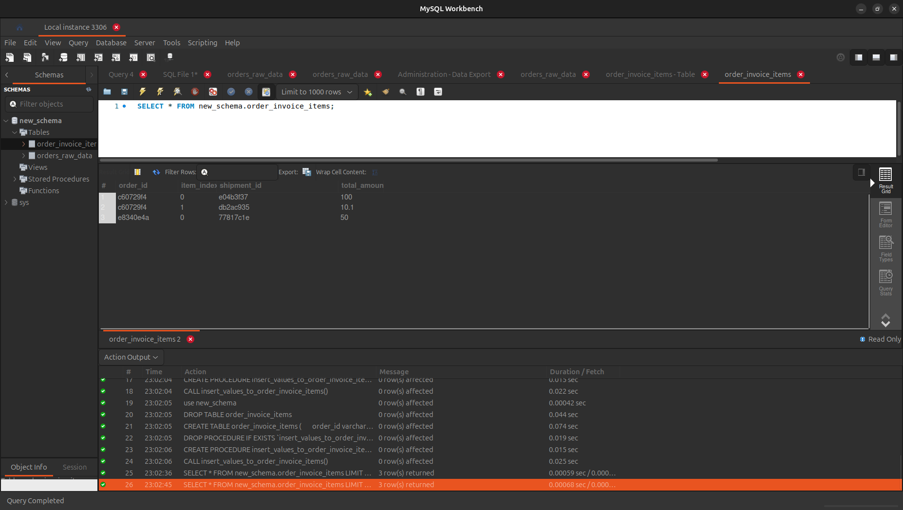

**Exercise 1**

**Output**:  

Step 1: open tool support mysql

Step 2: run './dump/new_schema_orders_raw_data.sql' to create 
orders_raw_data table and insert test data 

Step 3: run create_table.sql to create order_invoice_items

Step 4: select * from order_invoice_items; to see ouput

**Exercise 2**

**Output**:  

Step 1: install python

Step 2: open folder in vscode

Step 3: run sql_extractor.py

Step 4: open io.yaml to see output

**Exercise 3**

[Open Here](./ex3/EX3.pdf)